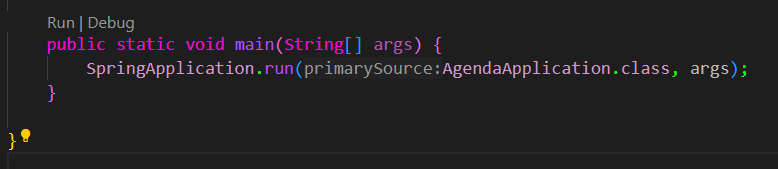
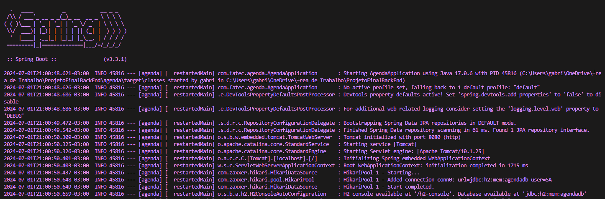

# Projeto Final Disciplina de programação web: Agenda de contatos
# Parte Back-End, desenvolvida em Springboot 3.3.1 e Java 17;

## Pré-requisitos para rodar o Back-end da melhor forma:

- Java 17 ou superior ( JDK 17 )

## Extensões para seu Visual Studio Code:
- Extension Pack for Java
- Spring Boot Extension Pack

## Para rodar esta API:
- Clone o repositório : https://github.com/GabeOlivver/projetoFinal-backEnd ;
- Abra o projeto no Visual Studio Code ;
- Navegue até a pasta "agenda";
- Vá até "src";
- main:java: AgendaApplication.java

- Clique em RUN e se tudo der certo, essa será a tela indicando que a API está funcionando :

- Abra um navegador de sua escolha e digite : http://localhost:8080/agenda;

- Um banco de dados simples irá abrir o que significa que o projeto está rodando !.

## Para testar a API separadamente:

- Instale a extensão API TESTER by Talend.

## Para testar com o Front-End siga o seguinte link:

https://github.com/GabeOlivver/ProjetoFinalFrontEnd

### Desenvolvido por : Gabriel Correa De Oliveira 

